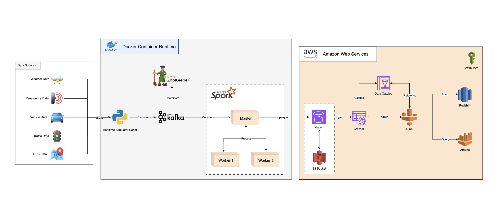

# IoT Event Streaming Pipeline

This project demonstrates a complete end-to-end IoT event streaming pipeline using modern technologies like Apache Kafka, Apache Spark, and AWS services such as S3, Glue, Athena, and Redshift.

The data is simulated in real-time and ingested into Kafka using a custom Python script, then processed in Spark, and stored in AWS S3. AWS Glue is used for ETL operations, and the data is queried using Athena and loaded into Redshift for analytics.

## Project Architecture


## Table of Contents

1. [Project Overview](#project-overview)
2. [Technology Used](#technology-used)
3. [Setup and Installation](#setup-and-installation)
4. [Instructions](#instructions)
5. [Project Structure](#project-structure)
6. [Features](#features)
7. [Contributing](#contributing)
8. [License](#license)

## Project Overview

The project simulates various types of IoT data, such as weather, emergency, vehicle, traffic, and GPS data. This data is streamed into Apache Kafka, processed in real-time by Apache Spark, and stored as Parquet files in AWS S3. AWS Glue crawlers and jobs are used to catalog and transform the data, making it queryable via Athena. Finally, the data is loaded into Redshift for further analytics.

## Technology Used

- **Docker**: Containerization of all services.
- **Apache Kafka**: For real-time data streaming.
- **Apache Spark**: For real-time data processing.
- **AWS S3**: Storage service for processed data.
- **AWS Glue**: ETL service for data transformation and cataloging.
- **AWS Athena**: Query service for data analysis.
- **AWS Redshift**: Data warehouse service for storing analytics data.
- **ZooKeeper**: For Kafka coordination.

## Setup and Installation

### Prerequisites

Ensure you have the following installed on your system:

- Docker
- Docker Compose
- Python 3.8+
- Apache Kafka
- AWS Account


## Instructions

1. **Clone the Repository**: 
   Clone this repository to your local machine.

   ```bash
   git clone https://github.com/YourUsername/IoT_Event_Processing_Pipeline.git
   cd IoT_Event_Processing_Pipeline
   ```

2. **Prepare Your Configuration**: Ensure all configuration files, including config.yaml, are correctly set with your AWS and Kafka configurations.
    - .env
    - config.yaml

3. **Set PYTHONPATH**: Export the `PYTHONPATH` to include the project directory (either on your local machine or within Docker).

    ```bash
    export PYTHONPATH=path/to/IoT_Event_Processing_Pipeline
    ```

4. **Install Requirements**: Install all required modules.

    ```bash
    pip install -r requirements.txt
    ```

4. **Launch Docker Compose**: Start the services by running the following command:

    ```bash
    docker compose up -d
    ```

5. **Trigger Data Simulation**: Run the data simulation script to start sending data to Kafka.

    ```bash
    python3 jobs/simulate_data.py
    ```

6. **Inspect Kafka Topic**: List all Kafka topics to verify that data is being streamed correctly:

    ```bash
    kafka-topics --list --bootstrap-server broker:9092
    ```

7. **Submit Spark Job**: Once the data has been simulated in the Kafka topic, start the Spark job to process the data.

    ```bash
    spark-submit --master spark://localhost:7077 jobs/ingest_data.py
    ```

8. **Monitor the Data Pipeline**: Check Spark processing logs and S3 for the processed Parquet files.

9. **Query Data with Athena**: Use Athena to query the cataloged data.
    - Navigate to the Athena console and run SQL queries against the Glue table.

10. **Load Data into Redshift**: Use AWS Glue or SQL commands to load the processed data from S3 into Redshift for further analysis.

11. **Terminate Project**: Stop data generation and spark job using the following command:

    ```bash
    docker compose down
    ```

## Project Structure

- **README.md**: Provides an overview and instructions for the project.
- **config.yaml**: Configuration file for AWS, Kafka, and other settings.
- **data_architecture.png**: Diagram of the project architecture.
- **docker-compose.yaml**: Docker Compose file to set up the environment.
- **jobs/**: Contains simulation and ingestion scripts.
  - **simulate_data.py**: Script to simulate IoT data and send it to Kafka.
  - **ingest_data.py**: Spark script to process Kafka streams and store data in S3.
- **plugins/**: Contains custom Kafka and Spark plugins.
  - **kafkastream_processor.py**: A class for Kafka stream processing.
  - **streaming_simulator.py**: A class for data simulation and Kafka streaming.
- **utils/**: Utility modules for configurations and helper functions.
  - **configparser.py**: Custom parser for handling YAML configurations.
- **requirements.txt**: Lists the Python packages required for the project.
- **snapshots/**: Contains snapshots of AWS services used in the project.

## Features

- Real-time data streaming and processing using Kafka and Spark.
- Data ingestion into AWS S3 in Parquet format.
- Automated data cataloging using AWS Glue.
- Data warehousing and analytics with Amazon Redshift and Athena.
- Scalable architecture using Docker containers.

## Contributing

Contributions are welcome! To contribute:

1. Fork the repository.
2. Create a new branch (`git checkout -b feature-branch`).
3. Make your changes and commit them (`git commit -m 'Add new feature'`).
4. Push to the branch (`git push origin feature-branch`).
5. Open a pull request.

Please ensure your code follows the project's coding standards and includes relevant tests.

## License

This project is licensed under the MIT License. See the `LICENSE` file for more details.